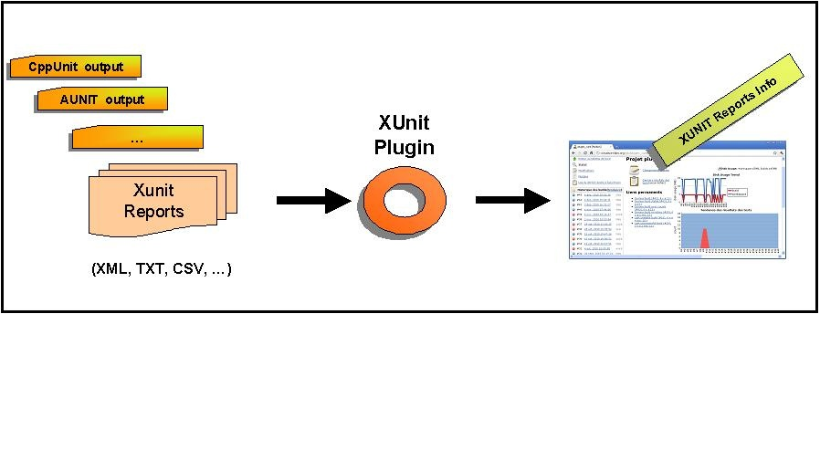
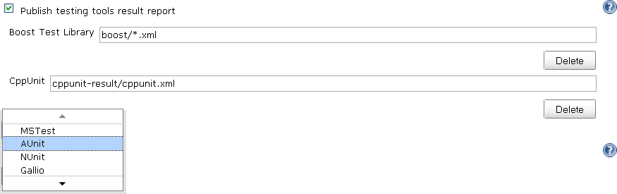
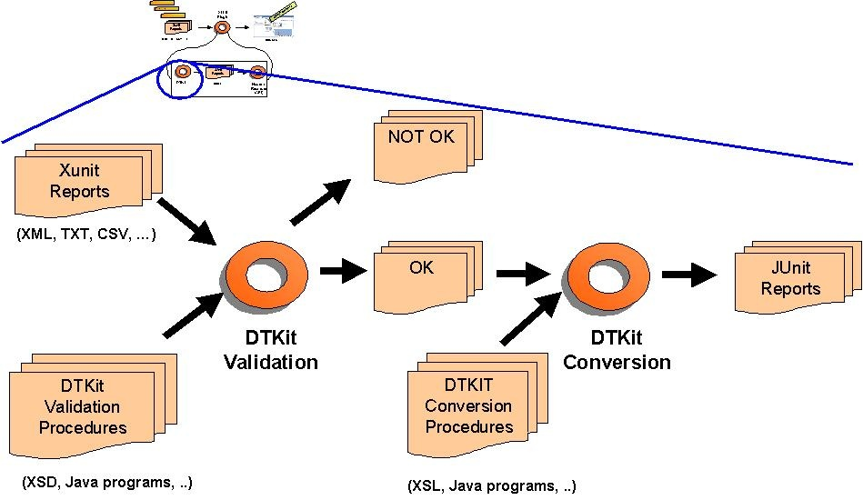
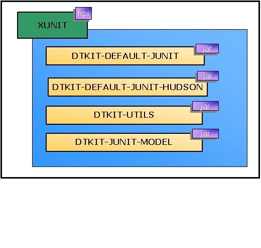

This plugin publishes test results of an execution of a testing tool in Jenkins.



# Features

-   Records xUnit tests
-   Mark the build unstable or fail according to threshold values

# Supported tools

## Embedded tools

* JUnit (supported schema are [Ant junit](https://github.com/windyroad/JUnit-Schema/blob/master/JUnit.xsd) and [Maven Surefire](http://maven.apache.org/surefire/maven-surefire-plugin/xsd/surefire-test-report.xsd))
* [AUnit](http://libre.adacore.com/libre/tools/aunit/)
* [MSTest](http://en.wikipedia.org/wiki/MSTest) (imported from [MSTest Plugin](https://github.com/jenkinsci/mstest-plugin))
* [NUnit](http://www.nunit.org/index.php) (imported from [NUnit Plugin](https://github.com/jenkinsci/nunit-plugin))
* [UnitTest++](http://unittest-cpp.sourceforge.net/)
* [Boost Test Library](http://www.boost.org/doc/libs/1_39_0/libs/test/doc/html/index.html)
* [PHPUnit](http://www.phpunit.de/)
* [Free Pascal Unit](http://www.freepascal.org/units.html)
* [CppUnit](https://sourceforge.net/projects/cppunit/)
* [MbUnit](http://www.mbunit.com/)
* [Googletest](http://code.google.com/p/googletest/)
* [EmbUnit](http://embunit.sourceforge.net/embunit/index.html)
* [gtester/glib](https://developer.gnome.org/glib/stable/gtester.html)
* [QTestLib](http://doc.qt.io/qt-5/qtest-overview.html)

## Other plugins as an extension of the xUnit plugin:

* [Gallio](http://www.gallio.org/) ([Gallio plugin](https://github.com/jenkinsci/gallio-plugin))
* [Parasoft C++Test tool](http://www.parasoft.com/jsp/products/cpptest.jsp) ([Cpptest Plugin](https://github.com/jenkinsci/parasoft-findings-plugin))
* [JSUnit](http://www.jsunit.net/) ([JSUnit Plugin](https://github.com/jenkinsci/jsunit-plugin))
* [JBehave](http://jbehave.org/reference/stable/hudson-plugin.html)
* [TestComplete](http://smartbear.com/product/testcomplete/overview/) ([TestComplete xUnit Plugin](https://github.com/jenkinsci/testcomplete-xunit-plugin))

## External contributions

For each xUnit tool, an embedded style sheet is used.
However, the plugin also enables you to use a custom style sheet for your own tool such as :

* [WebUI](http://github.com/versionone/webui-plugin)
* [Ranorex](http://github.com/ranorex/ranorex-to-xunit)

# Configuration

## Job Configuration

* Execute your testing tools manually or as a step of your build chain
* Give a pattern that specifies your test results



##  Provide User XSL

If you want to customise how a input report is transformed to a JUnit report of an existing tool type; xUnit provides a way to use your own XSL if placed at specific path.
Specify your XSLs in the `JENKINS_HOME/userContent` directory with the following convention:

```
$JENKINS_HOME/userContent/xunit/[toolName]/[version]/[any_name].xsl
```

For example:

```
$JENKINS_HOME/userContent/xunit/AUnit/3.x/aunit-to-junit.xsl
```

**Note**: The tool name and the version are taken from the label in the combo box from the UI.
If the tool doesn't have a version (N/A), do not create a version directory.

##  Custom Tool for unsupported formats

XUnit supports a large number of report format, but not all.
For unsupported report type an user could provide an own stylesheet that convert the original report into a supported JUnit report.

When choose the "Custom Tool" as tool type a path to the user XSL must be provided.
The path is relative and the plugin lookup the provided relative path using the following priority:

1.  on Jenkins controller
2.  on Jenkins agent
3.  relative to workspace

You could also provide an URL to the stylesheet.
If the XSL file is placed in the `$JENKINS_HOME/userContent` folder, the file will be available under the URL
`http(s)://$JENKINS_URL/userContent/<xsl file>`

### Publish test result checks

This feature requires:
* the installation of an additional plugin: [GitHub Checks Plugin](https://github.com/jenkinsci/github-checks-plugin)
* the configuration of GitHub App credentails, see [this guide](https://docs.cloudbees.com/docs/cloudbees-ci/latest/cloud-admin-guide/github-app-auth) for more details.

When enabled in the job configuration, this plugin will publish test results to GitHub through [GitHub checks API](https://docs.github.com/en/rest/reference/checks).
In the *Details* view of each check, test results will be displayed.

In order to enable the checks feature, set the property `skipPublishingChecks` to `false`
The plugin will default to using the stage name or branch of a parallel step prepended by `Tests` for the checks name.
If there are no enclosing stages or branches, `Tests` will be used. The name can also be overridden by a `withChecks` step.

The following snippet would publish three checks with the names `Tests / Integration`, `Tests` and `Integration Tests`, respectively.

```groovy
stage('Integration') {
  xunit (tools: [ BoostTest(pattern: 'integration/*.xml') ], skipPublishingChecks: false)
}
// no stage at all
xunit (tools: [ BoostTest(pattern: 'boost/*.xml') ], skipPublishingChecks: false)

stage('Ignored') {
  withChecks('Integration Tests') {
    xunit (tools: [ MSTest(pattern: '**/*.trx') ], skipPublishingChecks: false)
  }
}
```

# xUnit Architecture

## Global Architecture

When this plugin is installed and configured, Jenkins can transform test result reports produced by different testing tools into JUnit test result format.
The JUnit tests can then be recorded by Jenkins.
Jenkins can provide useful information about test results, such as the historical test result trend, web UI for viewing test reports, tracking failures, and so on.

Under the hood, xUnit Jenkins plugin delegates processing to [DTKit](https://plugins.jenkins.io/dtkit/).


## DTKit Activities for XUnit



## DTKit Packaging

## 

## Working with Pipelines

It is also possible to set an xUnit configuration in a pipeline job, but is somewhat more verbose.

For example, creating a boost pipeline (declarative) with the same
configuration as above would be:

**Example of pipeline**

```groovy
pipeline {
    agent any
    stages {
        stage('Test'){
            steps {
                sh "run_tests.bash"
            }
        }
    }
    post {
        always{
            xunit (
                thresholds: [ skipped(failureThreshold: '0'), failed(failureThreshold: '0') ],
                tools: [ BoostTest(pattern: 'boost/*.xml') ]
            )
        }
    }
 }
```

# Releases

**Moved to [GitHub repository page](https://github.com/jenkinsci/xunit-plugin/releases/)**

## Version 2.2.5

#### Improvements

-   [JENKINS-51645](https://issues.jenkins-ci.org/browse/JENKINS-51645) Add
    support for claims plugin in xUnit (nfalco79 to Arnaud)
-   [JENKINS-24224](https://issues.jenkins-ci.org/browse/JENKINS-24224) improve
    xunit plugin with test-stability plugin (nfalco79 to Arnaud)

#### Bugfixes

-   [JENKINS-53186](https://issues.jenkins-ci.org/browse/JENKINS-53186) NUnit
    2.x test cases with result Error are reported as Success (nfalco79)
-   Fix lookup strategy when user provides a custom stylesheets file to
    override the embedded one (nfalco79)
-   [JENKINS-53034](https://issues.jenkins-ci.org/browse/JENKINS-53034) Failure
    when validate NUnit 2.x reports generated by NUnit 3.x console
    (nfalco79)
-   [JENKINS-53036](https://issues.jenkins-ci.org/browse/JENKINS-53036) NPE
    after upgrade to 2.2.1 when run publisher (nfalco79)
-   [JENKINS-52908](https://issues.jenkins-ci.org/browse/JENKINS-52908) Newlines
    get ignored in failure message and possibly stack trace when
    uploading xUnitDotNet xml results (nfalco79)

## Version 2.1.0

#### Improvements

-   [JENKINS-32920](https://issues.jenkins-ci.org/browse/JENKINS-32920)
    Support for URL for stylesheet in Custom Tool (nfalco79)

#### Bugfixes

-   [JENKINS-52512](https://issues.jenkins-ci.org/browse/JENKINS-52512)
    Builds on agent fails when there is no report file even if set
    to do not fail (nfalco79)
-   [JENKINS-52400](https://issues.jenkins-ci.org/browse/JENKINS-52400)
    xUnit miss to add required attributes when converts Valgrind reports
    (nfalco79)

## Version 2.0.4

#### Improvements

-   Improved GoogleTest, FPCUnit, CppTest XSLT to produce a report more
    compliant with surefire XSD

#### Bugfixes

-   [JENKINS-52327](https://issues.jenkins-ci.org/browse/JENKINS-52327) java.nio.file.AccessDeniedException
    on Publish xunit Custom tool test report (nfalco79 to greghoeppner)
-   [JENKINS-52202](https://issues.jenkins-ci.org/browse/JENKINS-52202)
    xUnit reports "All test reports are empty" in case of parallel steps
    but reports are not empty (nfalco79)
-   [JENKINS-52253](https://issues.jenkins-ci.org/browse/JENKINS-52253)
    xUnit in case of multiple tool type processes only the first one
    (nfalco79)
-   [JENKINS-52173](https://issues.jenkins-ci.org/browse/JENKINS-52173)
    xUnit fails when converting gtester/glib2 input to junit format
    (nfalco79)
-   [JENKINS-51604](https://issues.jenkins-ci.org/browse/JENKINS-51604) XPathExeption
    when parsing QtTestLib Reports when a Test contains multiple
    Incidents (nfalco79)
-   [JENKINS-27860](https://issues.jenkins-ci.org/browse/JENKINS-27860) Build
    does not stop if it is marked as Failure when the opportune option
    is enabled (nfalco79)
-   [JENKINS-47194](https://issues.jenkins-ci.org/browse/JENKINS-47194) xUnit
    should not consider report generated by other xUnit step (nfalco79)
-   [JENKINS-52107](https://issues.jenkins-ci.org/browse/JENKINS-52107) Convertion
    exception for NUnit 2.1 reports because nunit-version attribute not
    contains only digits (nfalco79)
-   [JENKINS-41093](https://issues.jenkins-ci.org/browse/JENKINS-41093)
    For Unittest++ xml, only the first failure of each test case is
    recognized (nfalco79)
-   [JENKINS-51767](https://issues.jenkins-ci.org/browse/JENKINS-51767)
    xUnit 2.x XSD does not validate NUnit 2.x XML report file (nfalco79)
-   [JENKINS-51797](https://issues.jenkins-ci.org/browse/JENKINS-51797)
    xUnit.Net v2 parse error when time attribute is missing (nfalco79)
-   [JENKINS-51798](https://issues.jenkins-ci.org/browse/JENKINS-51798) GoogleTest
    parse error when time attribute is missing (nfalco79)
-   [JENKINS-51561](https://issues.jenkins-ci.org/browse/JENKINS-51561)
    xUnit plugin fails to parse NUnit 2 report format generated by NUnit
    3.6.0.0 (nfalco79)
-   [JENKINS-51465](https://issues.jenkins-ci.org/browse/JENKINS-51465)
    Exception in XSL Transformation cause JEP-200 (nfalco79)
-   [JENKINS-51481](https://issues.jenkins-ci.org/browse/JENKINS-51481)
    Parse error occur when NUnit report have categories (nfalco79)
-   [JENKINS-26227](https://issues.jenkins-ci.org/browse/JENKINS-26227)
    xUnit plugin doesn't use OS culture when reads time values in
    [xUnit.net](http://xunit.net/) output (nfalco79)
-   [JENKINS-12417](https://issues.jenkins-ci.org/browse/JENKINS-12417)
    xUnit problems with CppTest reports generated with default options
    (nfalco79)
-   [JENKINS-28871](https://issues.jenkins-ci.org/browse/JENKINS-28871)
    CppTest 9.5 report file seems not valid for xUnit when no tests was
    executed (nfalco79)

## Version 2.0.0

#### Breaking Changes

I have introduce some schemas validation becase the large number of
issues opened to xUnit plugin. Those issues are caused by custom
attributes or XML DOM in the report generated by some user/tools report
logger also if they declare to produce a valid report file. This cause
me to spend a lot of time to investigate what is right and what is wrong
and how to implement the XSL without it goes in error during
transformation. 

-   **Official supported JUnit schema are [Ant junit](https://github.com/windyroad/JUnit-Schema/blob/master/JUnit.xsd)
    and [Maven Surefire](http://maven.apache.org/surefire/maven-surefire-plugin/xsd/surefire-test-report.xsd)).**

In case you are using a non java tools that declares to produce a JUnit
compatible report, ensure the report respects one of the widely used
supported schemas. If not than select as test type the build step
"Custom Tool" and
use [this](https://github.com/jenkinsci/xunit-plugin/blob/master/docs/files/input.xsl)
XSL as
described [here](#provide-user-xsl).

-   **NUnit 2.x (2.0 - 2.6) schema validation from official
    distribution.**

In case you are using a tools that declares to produce a NUnit 2
compatible report, ensure the report respects the official schemas. If
not than select as test type the build step "Custom Tool" and provide a
XSL as
described [here](#provide-user-xsl).

#### Improvements

-   Improved MSTest, MbUnit, AUnit, NUnit, QtTest XSLT to produce a
    report more compliant with surefire XSD
-   Change UI rendering of the report tool and clarify the pattern
    description
-   [JENKINS-37611](https://issues.jenkins-ci.org/browse/JENKINS-37611)
    Add support for pipeline using @Symbol annotation to xunit and its
    parameters (nfalco79)

#### Bugfixes

-   [JENKINS-42715](https://issues.jenkins-ci.org/browse/JENKINS-42715)
    xUnit does not support PHPUnit 5.x skipped attribute (nfalco79 to
    ray)
-   [JENKINS-47194](https://issues.jenkins-ci.org/browse/JENKINS-47194)
    xUnit should not consider report generated by other xUnit step
    (nfalco79)
-   [JENKINS-10911](https://issues.jenkins-ci.org/browse/JENKINS-10911)
    xUnit not detecting Ignored MSTest and NUnit Tests (nfalco79)
-   [JENKINS-51347](https://issues.jenkins-ci.org/browse/JENKINS-51347)
    Test Status "notrun" being reported as "failed" test (nfalco79)
-   [JENKINS-13113](https://issues.jenkins-ci.org/browse/JENKINS-13113)
    xUnit plugins detects MSTEST "NotExecuted" as successed instead of
    skipped (nfalco79)

## Version 1.104

#### Improvements

-   [JENKINS-33450](https://issues.jenkins-ci.org/browse/JENKINS-33450)
    Support for NUnit3 which uses a different XML format by NUnit2
    (nfalco79 to alexschwantes)

-   [JENKINS-50658](https://issues.jenkins-ci.org/browse/JENKINS-50658)
    Fix xsd to be compliant with surefire report and rerun option
    (nfalco79 to alemorato)
-   Move plugin to pipeline so that commits and pull request could be
    checked for test failure

#### Bugfixes

-   [JENKINS-48945](https://issues.jenkins-ci.org/browse/JENKINS-48945)
    Testreport lacks of those test in which the hashcode of two
    different testsuite name coincide (nfalco79)
-   [JENKINS-33385](https://issues.jenkins-ci.org/browse/JENKINS-33385)
    Testresult doesn't show test name in case the package is empty
    (nfalco79 to Zenger Alexander)

-   [JENKINS-51056](https://issues.jenkins-ci.org/browse/JENKINS-51056)
    xUnit throws NPE when no threshold was specified (nfalco79)
-   [JENKINS-35660](https://issues.jenkins-ci.org/browse/JENKINS-35660)
    QTestLib time information is lost (nfalco79 to kpop)
-   [JENKINS-28471](https://issues.jenkins-ci.org/browse/JENKINS-28471)
    xUnit should compare test results to last build where tests was
    recorded to calculate correctly thresholds (nfalco79 to Jimilian)
-   [JENKINS-50378](https://issues.jenkins-ci.org/browse/JENKINS-50378)
    Skipped count percentage is affected by integer rounding (nfalco79
    to pauljohnston2009)
-   [JENKINS-42031](https://issues.jenkins-ci.org/browse/JENKINS-42031)
    xUnit Plugin Does Not Parse Some Boost 1.63 Test Reports (nfalco79
    to aschet)
-   Relax BoostTest code line validation (nfalco79 to penberg)
-   Ensure testuite time attribute is valid for NUnit
-   [JENKINS-24382](http://wiki.jenkins-ci.org/display/JENKINS/xUnit+Plugin)
    Add basic support for Unit

## Version 1.100

-   Fix
    [JENKINS-30812](http://wiki.jenkins-ci.org/display/JENKINS/xUnit+Plugin) -
    added parsing for gtest errors so that a failure to run a test is
    considered a test failure
-   Fix
    [JENKINS-27240](http://wiki.jenkins-ci.org/display/JENKINS/xUnit+Plugin) -
    Workflow integration XUnit as a SimpleBuildSte
